# Agentic Learning Flow

[](https://github.com/HayatullahFarahi/study-agent/generate)

A Copilot-powered personal learning system that tracks your progress across books, courses, and slide decks — session by session.

---

## Demo

<p align="center">
  
</p>

A **demo article** is included out of the box so you can try the system immediately after cloning:

```
/start-study demo       ← starts a session on "AI Engineering Fundamentals" demo article
```

No setup needed — the demo material, manifest, and session logs are all pre-configured in the `demo/` folder. Covers the AI engineering stack, prompting, RAG, evaluation, and going to production.

---

## How It Works

```
Type /start-study <material>  →  Copilot teaches it creatively  →  Progress auto-tracked  →  /end-session saves all
```

Copilot acts as your personal tutor via **agent skills** — slash commands that appear in the chat `/` menu. It knows where you left off, dynamically tracks what you've covered, saves key concepts, and can quiz you at any time. Every concept is explained with **visual diagrams, analogies, code examples, and mental models** so material sticks.

---

## Prerequisites

| Requirement | Details |
|---|---|
| **VS Code** | [Download](https://code.visualstudio.com/) — version 1.99 or later recommended |
| **GitHub Copilot subscription** | Individual or Business plan — [get one here](https://github.com/features/copilot) |
| **Copilot agent mode** | Must be enabled in VS Code: `Settings → GitHub Copilot → Enable Agent Mode` |
| **Python 3.x** *(optional)* | Only needed if your materials are in `.pdf`, `.pptx`, or `.docx` format — used for auto-conversion |

> **Note:** Slash commands (`/start-study`, `/quiz-me`, etc.) only appear in **Copilot Chat in agent mode**. They will not work in the inline editor or ask mode.

---

## Folder Structure

```
<workspace-root>/
  .github/
    copilot-instructions.md     ← master behavior rules for the agent
    skills/                     ← agent skills (slash commands)
      add-material/SKILL.md
      start-study/SKILL.md
      deep-dive/SKILL.md
      quiz-me/SKILL.md
      check-progress/SKILL.md
      save-note/SKILL.md
      ask-later/SKILL.md
      end-session/SKILL.md
      summarize-chapter/SKILL.md
  LEARNING-MATERIALS.md         ← guide for adding materials (tracked by git)
  learning-materials/           ← (gitignored) paste your PDFs, PPTs, ZIPs here
    <slug>/
  temp/
    progress/                   ← (gitignored) all progress tracking lives here
      _index.json               ← index of all registered materials
      _template.json            ← schema template for new materials
      <slug>/
        manifest.json           ← progress state for this material
        session-log.md          ← tracked session history
        spotlight-log.md        ← standalone deep-dive session history
```

---

## Slash Commands

Type `/` in Copilot Chat to see all available skills. VS Code agent mode required.

| Command | What it does |
|---|---|
| `/add-material <name>` | Register a new learning material |
| `/start-study <slug>` | Start or resume a session (any type — book, course, slides, article) |
| `/deep-dive <topic> [in <slug>]` | Standalone focused deep-dive, no progress change |
| `/quiz-me <slug> [unit: <id>]` | Quiz yourself on covered material |
| `/check-progress [slug]` | Show progress across all or one material |
| `/save-note <text> [in <slug>]` | Save a key concept immediately |
| `/ask-later <question> [in <slug>]` | Log a question for later |
| `/end-session` | End session and flush all progress to disk |
| `/summarize-chapter <slug> chapter: <id>` | Generate a creative visual summary of a chapter |

---

## Quick Start

```
/add-material Clean Code          ← adds a new material
/start-study clean-code           ← begins or resumes a tracked session
/deep-dive backpropagation in ml-a-z  ← focused topic, no progress change
/quiz-me ml-a-z                   ← test yourself on covered material
/end-session                      ← saves everything to disk
/check-progress                   ← see all materials
```

---

## How Progress Tracking Works

- **Automatic** — Copilot tracks units and concepts as the session flows; you never need to say "mark as covered"
- **Inline saves** — saying `"save progress"`, `/save-note`, or `/ask-later` triggers an immediate write to disk
- **Full flush** — `/end-session` writes all covered units, updates `percentComplete`, and logs the session
- **Deep-dive isolation** — `/deep-dive` sessions never pollute tracked progress

---

## Creative Teaching Style

When studying, Copilot explains every concept using a structured, visual format:

| Block | Purpose |
|---|---|
| 🎯 **Why It Matters** | Opens every concept — motivates before explaining |
| 📌 **Key Concept** | Core explanation, one idea at a time |
| ASCII diagram | Visual structure for algorithms, flows, comparisons |
| 💡 **Analogy** | Real-world parallel to make abstract ideas click |
| ⚠️ **Common Mistake** | Flags frequent misunderstandings |
| 🔧 **In Practice** | Annotated code snippet or real-world usage |
| 🧠 **Mental Model** | Closes every concept — one sticky-note summary |
